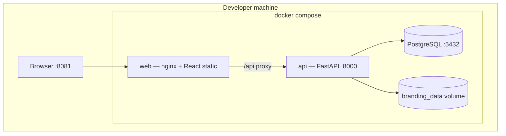
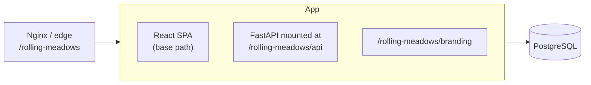
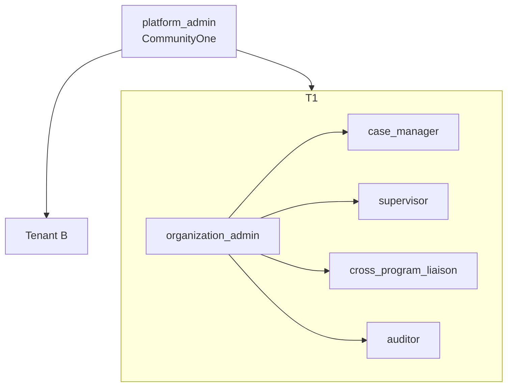
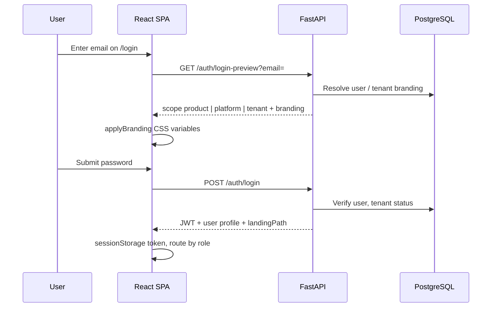
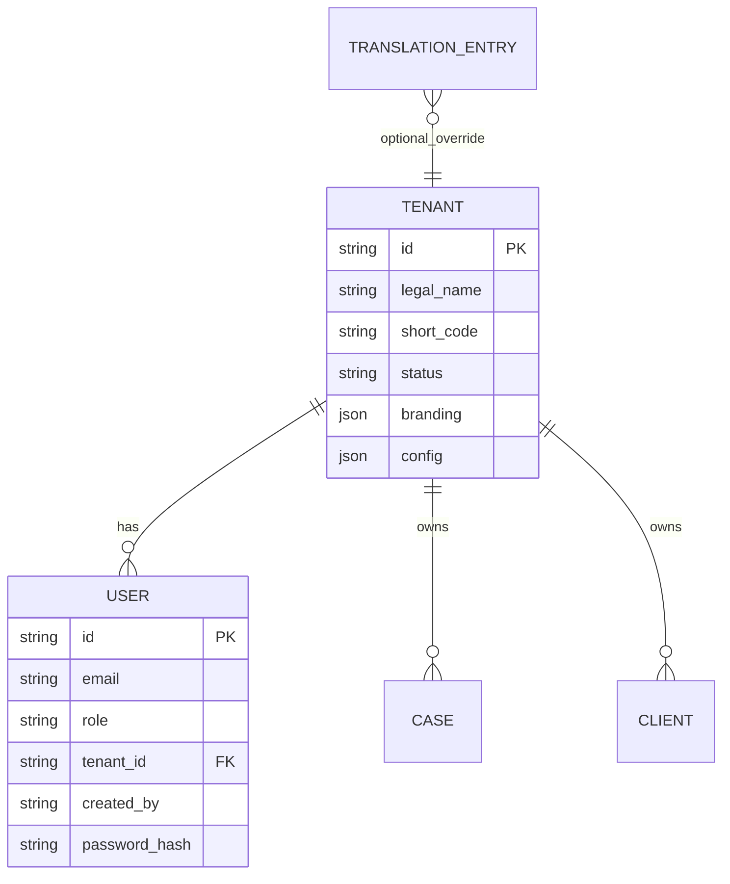

# Technical architecture — Rolling Meadows / CommunityOne

**Version:** 0.3.x (codebase)  
**Date:** 18 September 2026  
**Status:** As-built reference (supersedes outdated MongoDB references in older OpenSpec design notes)

---

## 1. Purpose and scope

This document describes the **as-built** architecture of the deployable application under `codebase/`: a multi-tenant human-services case management platform branded **CommunityOne**, with **Rolling Meadows** as the primary demo tenant.

It covers:

- Deployment and runtime topology  
- Logical modules and boundaries  
- Identity, roles, and tenant isolation  
- Data persistence and key entities  
- Branding and internationalization  
- Integration and API contract  
- Security and observability  
- Platform-fit vs ADRs  

For operational admin behavior, see [codebase/docs/administration-and-roles.md](../codebase/docs/administration-and-roles.md). For delivery context, see [HANDOVER.md](./HANDOVER.md).

---

## 2. Platform-fit (ADR summary)

| ADR | Decision |
|-----|----------|
| ADR-0001 | **Exception (ADR-0017):** Primary API is **Python FastAPI**, not Node/Express. React SPA retained. |
| ADR-0003 | **As-is:** Container-first; Docker Compose local; single image option for production. |
| ADR-0004 | **Adapted:** **PostgreSQL** as system of record (design originally cited MongoDB; implementation migrated). |
| ADR-0006 | **As-is:** JWT auth, role checks, `tenant_id` from identity — not from client on data APIs. |
| ADR-0009 | **As-is:** OpenAPI contract at [openapi.yaml](./openapi.yaml). |

**Pattern:** Modular monolith — one API process, feature modules enabled via `API_ENABLED_MODULES`.

---

## 3. Deployment topology

### 3.1 Local development (Docker Compose)



| Service | Port | Role |
|---------|------|------|
| `web` | 8081 | Serves Vite build; proxies `/api` to `api` |
| `api` | 8000 | REST API, branding static mount, optional OpenAPI |
| `postgres` | 5432 | Persistent relational store |

### 3.2 Production (single container)



- **Public URL:** `https://foundry.inapp.com/rolling-meadows`  
- **API:** `.../rolling-meadows/api`  
- **Health:** `.../rolling-meadows/api/health`  

Configuration: `BASE_PATH`, `API_MOUNT_PATH`, `STATIC_DIR`, `JWT_SECRET`, `DATABASE_URL` (see `codebase/.env.example`, `codebase/README.md`).

---

## 4. Application structure

### 4.1 Repository layout

```
codebase/
├── api/app/
│   ├── main.py              # SPA shell + API mount (prod) or API-only (dev)
│   ├── core/                # config, security, deps, roles
│   ├── db/                  # SQLAlchemy engine, init_db
│   ├── models/              # tenant, user, case, client, i18n, ...
│   ├── routers/             # HTTP adapters per domain
│   ├── services/            # domain logic, branding, translations, tenants
│   └── seed/                # demo tenants, users, catalogue, cases
├── web/src/
│   ├── api/                 # Typed HTTP client
│   ├── auth/                # AuthContext, guards, permissions
│   ├── branding/            # applyBranding, provider, product vs tenant
│   ├── navigation/modules.ts
│   ├── pages/               # Feature pages (platform, admin, cases, ...)
│   └── i18n/                # Locale bundles + runtime merge
├── docker-compose.yml
└── docker-compose.prod.yml
```

### 4.2 API modules (enabled modules)

Controlled by `API_ENABLED_MODULES` (default includes):

| Module | Router prefix (typical) | Responsibility |
|--------|-------------------------|----------------|
| `health` | `/health` | Liveness |
| `auth` | `/auth` | Login, me, login-preview, translation bundles |
| `platform` | `/platform` | Tenants, settings, locales, translations, org admins |
| `admin` | `/admin` | Tenant-scoped users, config, overrides, audit |
| `clients` | `/clients` | Client registry, search, profile |
| `cases` | `/cases` | Case lifecycle, workspace |
| `catalog` | `/catalog` | Programs, workflows |
| `enrollments` | `/enrollments` | Bulk enroll |
| `liaison` | `/liaison` | Cross-program lookup |
| `workflow` | `/workflow` | Task board |
| `documents` | `/documents` | Document vault |
| `reports` | `/reports` | Standard and custom reports |

**Layering:** Routers validate auth/roles → call services → SQLAlchemy models. No separate repository package; queries live in services/routers.

---

## 5. Identity, roles, and navigation

### 5.1 Role hierarchy (CR-2026-002)



| Role | `tenant_id` | Primary UI scope |
|------|-------------|------------------|
| `platform_admin` | `null` | `/platform/*` only |
| `organization_admin` | set | Operations + `/admin/users` |
| Operational roles | set | Operations only |
| `tenant_admin` | set | **Legacy** — not used in new flows; demo account inactive |

### 5.2 Authentication flow



**JWT claims (conceptual):** subject user id, role, tenant id (if any), expiry.  
**Guards:**

- `ProtectedRoute` — requires login  
- `RequireRole` / capability checks — route-level  
- `RestrictPlatformAdminScope` — platform admin cannot leave `/platform`  

### 5.3 Tenant isolation rule

All tenant-scoped reads/writes derive **`tenant_id` from the authenticated user document**, not from request body or query parameters (except platform routes that explicitly target a tenant by id for super admin).

Organization admin user listing additionally filters:

- `created_by = current_user.id`  
- `role IN operational_roles`  

---

## 6. Data architecture

### 6.1 Core entities



| Entity | Notes |
|--------|--------|
| **Tenant** | Organization; branding JSON (display name, colors, logo URL, tagline) |
| **User** | Unique `(email, tenant_id)`; `created_by` for delegation audit |
| **TranslationLocale / TranslationEntry** | Platform catalogue (`tenant_id` null) + optional tenant overrides |
| **Case, Client, …** | Operational data scoped by `tenant_id` |

### 6.2 Schema evolution

- **No Alembic** in repo at handover; `init_db()` uses SQLAlchemy `create_all` plus idempotent `ALTER TABLE ... ADD COLUMN IF NOT EXISTS` for additive columns (e.g. `users.created_by`).
- **Seed:** `seed_auth_data_if_empty` on API startup when auth module enabled; includes demo users and translation catalogue import.

### 6.3 Branding storage

- Tenant logos uploaded via API → files under `settings.branding_dir` (Docker volume).
- URLs served at `/branding/...` (with base path prefix in production).
- Web dev nginx proxies `/branding/` to API.

---

## 7. Frontend architecture

### 7.1 Stack

- **React 18** + **Vite** + **TypeScript**
- **React Router** for SPA routes
- **i18n:** static JSON + API bundles merged at runtime (`I18nContext`)

### 7.2 Shell and modules

- `AppShell` — top bar, module sidebar, role-based module list from `navigation/modules.ts`
- **Super admin:** Administration module expanded by default — Tenants, Locale labels, Users
- **Org admin:** Administration → Users only (+ operational modules)

### 7.3 Branding

| Context | Behavior |
|---------|----------|
| Login | `login-preview` → tenant vs CommunityOne hero |
| Authenticated | `BrandingProvider` applies `user.tenant.branding` or product branding for platform admin |
| CSS | `--color-primary`, accent, focus ring via `applyBranding.ts` |

---

## 8. Internationalization

**Resolution order (runtime):**

1. Tenant override (if implemented for key)  
2. Platform DB translation  
3. Static locale JSON in web build  
4. English fallback  

**Administration:**

- **Super admin:** `/platform/translations` — master catalogue, Excel import/export  
- **Org admin:** no locale labels menu (by design CR-2026-002)  
- Global `/admin/translations*` restricted to `platform_admin` in API  

---

## 9. API contract and clients

- **Canonical spec:** [openapi.yaml](./openapi.yaml)  
- **Web client:** `web/src/api/*.ts` — wraps fetch with bearer token  
- **Operation IDs** align with OpenAPI for codegen-friendly naming  

When spec and implementation diverge, **running API** at `/docs` (local) or `/rolling-meadows/api/docs` (prod) is authoritative until OpenAPI is updated.

---

## 10. Security architecture

| Control | Implementation |
|---------|----------------|
| Authentication | JWT HS256, secret from env |
| Password storage | bcrypt |
| Authorization | `require_roles`, `require_roles(*TENANT_ADMIN_ROLES)`, capability map in web |
| Tenant isolation | Query filters on `tenant_id` from JWT user |
| Platform scope | `RestrictPlatformAdminScope` + platform-only routes |
| CORS | Configured origins |
| Error handling | Generic login failure; structured JSON errors |
| Correlation | `x-correlation-id` middleware |

**Not implemented:** MFA, IdP, rate limiting (beyond basic patterns), field-level encryption.

---

## 11. Observability and operations

| Concern | Status |
|---------|--------|
| Health endpoint | `/health` |
| Correlation ID | Request/response header |
| Structured metrics/tracing | Not in scope for demo deploy |
| Admin audit | `write_admin_audit` for many admin/platform mutations |

---

## 12. Build, test, and delivery

| Action | Command / artifact |
|--------|---------------------|
| Local stack | `cd codebase && docker compose up --build` |
| Web only | `cd codebase/web && npm run dev` |
| API only | `uvicorn app.main:app --reload` |
| Production package | `codebase/package.bat` → zip + image tar |
| Deploy | `deploy.sh` on Linux host |

---

## 13. Patterns considered (architecture phase)

| Pattern | Verdict |
|---------|---------|
| Modular monolith | **Adopted** |
| Microservices | Deferred |
| CQRS / event sourcing | Not used |
| BFF separate from API | Not used — SPA talks to API directly |
| Repository layer | Light — services + SQLAlchemy |
| Plugin architecture | ADR direction only; not implemented in RMHS codebase |

---

## 14. Evolution paths

1. **Alembic migrations** for controlled schema change  
2. **OpenAPI-first CI** — diff spec vs FastAPI routes  
3. **IdP adapter** behind `/auth` without breaking SPA contract  
4. **Service extraction** — reports or documents as first split (ADR-0016)  
5. **Tenant override UI** for labels if product reintroduces scoped overrides  

---

## 15. Related documents

| Document | Purpose |
|----------|---------|
| [TECHNOLOGIES.md](./TECHNOLOGIES.md) | Stack and version list |
| [HANDOVER.md](./HANDOVER.md) | Delivery summary, QA, ops |
| [CR-2026-002](./CR-2026-002-super-admin-org-admin-locale-branding.md) | Admin UX requirements |
| [codebase/README.md](../codebase/README.md) | Run/deploy commands |
| [openspec/changes/rolling-meadows-platform/design.md](../openspec/changes/rolling-meadows-platform/design.md) | Historical auth bootstrap design |

---

*End of technical architecture document.*
