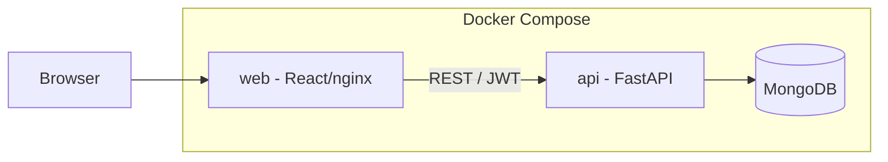

# Design: Rolling Meadows Platform

## Platform-fit decision (Day-1 gate)

| ADR | Decision |
|-----|----------|
| ADR-0001 | **Exception via ADR-0017** — Python FastAPI is the primary API instead of Express/Node. React frontend and MongoDB retained. Modular monolith boundaries preserved. |
| ADR-0003 | **As-is** — Container-first deployment; Docker Compose for web + api + mongo. |
| ADR-0004 | **As-is** — MongoDB as system of record; tenant_id on every document. |
| ADR-0006 | **As-is** — Tenant isolation, JWT auth, service-layer RBAC (auth slice first). |
| ADR-0009 | **As-is** — OpenAPI contract at `Docs/openapi.yaml`. |

**Rationale:** Delivery team standard is React + FastAPI. Python aligns with platform capability-service direction; Express starter cloned from scaffold is replaced in `codebase/api/`.

## System context



## Repository layout

```
codebase/
├── api/                 # Python FastAPI (primary backend)
│   ├── app/
│   │   ├── main.py
│   │   ├── core/        # config, security, deps
│   │   ├── routers/     # health, auth
│   │   ├── db/          # Mongo connection
│   │   └── seed/        # demo users
│   ├── requirements.txt
│   └── Dockerfile
├── web/                 # React + Vite
│   ├── src/
│   │   ├── api/         # OpenAPI-aligned client
│   │   ├── auth/        # AuthContext, ProtectedRoute
│   │   └── pages/       # Login, Home (role landing)
│   ├── Dockerfile
│   └── nginx.conf
├── docker-compose.yml
└── .env.example
```

**Scaffold divergence:** Express `api/src/` removed; Python FastAPI replaces it. Root `codebase/Dockerfile` (Node API) superseded by per-service Dockerfiles.

## Authentication design

### Phase 1 (this change) — Credential login

| Concern | Decision |
|---------|----------|
| Protocol | JWT bearer tokens (HS256, configurable secret) |
| Login | `POST /auth/login` — email + password |
| Session | Client stores token in memory + sessionStorage; sends `Authorization: Bearer` |
| Tenant resolution | `tenant_id` embedded in JWT and user record; never accepted from client on data APIs |
| Password storage | bcrypt hashes in MongoDB `users` collection |
| Landing routes | Mapped from role per BRD §5.2 (mirrors prototype `index.js` redirects) |

### Phase 2 (pre go-live) — Directory SSO + MFA

OIDC/SAML per tenant; MFA for admin/supervisor. Auth router designed for adapter swap without changing React contract shape.

### Seed users (tenant: `tenant-rolling-meadows`)

Aligned with prototype roles in `Docs/ui/js/seed/seedData.js`:

| Email | Role | Landing |
|-------|------|---------|
| case.manager@demo.rmhs.app | case_manager | /cases/new |
| supervisor@demo.rmhs.app | supervisor | /cases/new |
| liaison@demo.rmhs.app | cross_program_liaison | /liaison |
| auditor@demo.rmhs.app | auditor | /reports |

Default password from env `SEED_USER_PASSWORD` (documented in `.env.example`).

## Patterns considered

| Pattern | Choice | Rationale |
|---------|--------|-----------|
| Modular monolith | **Chosen** | Single deployable unit; clear module boundaries before service extraction |
| Microservices | Rejected | Premature for bootstrap |
| Layered / thin routers | **Chosen** | FastAPI routers → services → repositories |
| Repository | **Chosen** | Tenant-scoped data access; mirrors prototype repositories |
| JWT bearer | **Chosen** | Stateless API; fits Docker horizontal scale |
| Session cookies only | Rejected for now | Complicates SPA cross-origin; JWT simpler for Phase 1 |
| Hexagonal / ports | Partial | Auth adapter seam for future IdP |
| Event-driven | Rejected | No async domain events in auth slice |

## Security (seed-02)

- CORS restricted to configured web origin
- Password min length 8 on login request
- Generic 401 on invalid credentials (no user enumeration)
- Correlation ID middleware (`x-correlation-id`)
- Tenant_id in JWT validated on every authenticated request

**Observability:** N/A — auth slice only; structured logging on login success/failure in Phase 2 SEED.

**Performance:** N/A — auth endpoints low volume.

**Rollback:** Revert Docker images; Mongo volume retains data; feature flag not required for bootstrap.

## UI reference

Production React screens SHALL follow `Docs/ui/` for operational flows as they are migrated. Login page layout inspired by prototype sign-in (`Docs/ui/js/pages/index.js`) but uses email/password instead of role selector.

## Configuration

| Key | Service | Description |
|-----|---------|-------------|
| MONGODB_URI | api | Mongo connection string |
| JWT_SECRET | api | Signing secret (required in production) |
| JWT_EXPIRES_MINUTES | api | Token TTL |
| CORS_ORIGINS | api | Allowed web origins |
| SEED_USER_PASSWORD | api | Initial demo user password |
| VITE_API_BASE_URL | web | API base URL for browser |

## OpenAPI

Canonical contract: `Docs/openapi.yaml`. FastAPI implementation must match operationIds: `getHealth`, `login`, `getCurrentUser`, `logout`.
